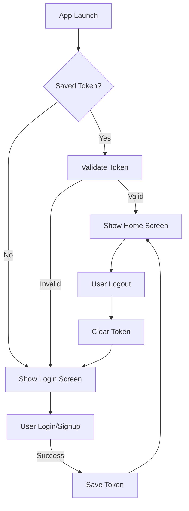

# Kiss PocketBase Auth Example

A comprehensive Flutter example app demonstrating authentication flows with PocketBase using the `kiss_pocketbase_auth` package. This example showcases best practices for implementing secure authentication in Flutter applications.

## Features

- **User Authentication**
  - Email and password login
  - User registration flow
  - Persistent authentication state across app restarts
  - Automatic token validation on app launch
  - Secure logout functionality

- **Security & State Management**
  - JWT token persistence using `shared_preferences`
  - Automatic token refresh handling
  - Secure credential handling
  - Authentication state validation

## Prerequisites

Before running this example, ensure you have:

1. **Flutter SDK** (3.8.1 or later)
   ```bash
   flutter --version
   ```

2. **PocketBase server** running locally
   - Default URL: `http://localhost:8090`
   - Admin panel: `http://localhost:8090/_/`

3. **Development tools**
   - IDE with Flutter support (VS Code, Android Studio, etc.)
   - iOS Simulator/Android Emulator or physical device

## Quick Start

1. **Start PocketBase server** (from the root directory):
   ```bash
   ./scripts/docker-up.sh
   ```
   
   This will start PocketBase with:
   - API endpoint: `http://localhost:8090/api/`
   - Admin UI: `http://localhost:8090/_/`

2. **Navigate to the example app**:
   ```bash
   cd example/kiss_pocketbase_example
   ```

3. **Install dependencies**:
   ```bash
   flutter pub get
   ```

4. **Run the app**:
   ```bash
   # For debug mode with hot reload
   flutter run
   
   # Or specify a device
   flutter run -d chrome  # Web
   flutter run -d ios     # iOS
   flutter run -d android # Android
   ```

## Creating Test Users

You can create test users in several ways:

### Method 1: Using the App's Signup Feature

The example app now supports full user registration:

1. Launch the app
2. Tap **"Don't have an account? Sign up"** from the login screen
3. Fill in the signup form:
   - Email: Any valid email address
   - Password: At least 8 characters
   - Confirm password
4. Tap **"Sign Up"** to create and login automatically

### Method 2: PocketBase Admin UI

1. Open the PocketBase Admin panel: http://localhost:8090/_/
2. Create an admin account if prompted
3. Navigate to **Collections → Users**
4. Click **"New record"** to create test users manually

### Method 3: Using Test Helpers

For automated testing, you can create users programmatically:

```dart
// In your test setup
await PocketBaseTestHelper.createTestUser(
  email: 'test@example.com',
  password: 'testpassword123',
);
```

### Suggested Test Credentials

For manual testing, you can use:
- **Email**: `test@example.com`
- **Password**: `testpassword123`

## Project Structure

```
kiss_pocketbase_example/
├── lib/
│   ├── main.dart                 # App entry point with splash screen
│   ├── screens/
│   │   ├── login_screen.dart     # Login UI with form validation
│   │   ├── signup_screen.dart    # Registration UI
│   │   └── home_screen.dart      # Authenticated user dashboard
│   └── services/
│       └── auth_service.dart     # Authentication logic & token management
├── pubspec.yaml                  # Dependencies configuration
└── test/
    └── widget_test.dart          # Widget tests
```

## Screen Details

### 🔐 Login Screen (`login_screen.dart`)
- **Features**:
  - Email/password form with validation
  - Real-time error feedback
  - Loading states during authentication
  - Navigation to signup screen
- **Error Handling**:
  - Invalid credentials
  - Network connectivity issues
  - Server errors

### 📝 Signup Screen (`signup_screen.dart`)
- **Features**:
  - Email/password registration form
  - Password confirmation field
  - Input validation (email format, password strength)
  - Success feedback and auto-navigation to login
- **Note**: Creates users via PocketBase API (requires proper setup)

### 🏠 Home Screen (`home_screen.dart`)
- **Displays**:
  - User profile information (ID, email, verification status)
  - JWT token details and expiration
  - Authentication claims in formatted JSON
  - Raw user record data
- **Actions**:
  - Logout button with confirmation
  - Token refresh status

## Authentication Flow



### Flow Details

1. **Initial Check**: Splash screen checks `SharedPreferences` for saved JWT token
2. **Token Validation**: Validates token with PocketBase server
3. **Smart Navigation**:
   - ✅ Valid token → Home screen (authenticated state)
   - ❌ Invalid/expired token → Login screen
   - 🆕 No token → Login screen
4. **Authentication**: Login/signup creates new session and persists token
5. **Session Management**: Logout clears token and navigates to login

## Implementation Details

### Token Persistence

```dart
// Token is automatically saved on successful login
await prefs.setString('auth_token', token);

// Token is validated on app startup
final token = prefs.getString('auth_token');
if (token != null) {
  await _validator.validateToken(token);
}
```

### Error Handling

The example demonstrates proper error handling for:

- **Authentication Errors**
  - Invalid credentials (401)
  - Account not verified
  - Account disabled
  
- **Network Errors**
  - Connection timeout
  - No internet connection
  - Server unreachable
  
- **Data Errors**
  - Malformed responses
  - Invalid JWT tokens
  - Expired tokens

## Configuration

### Using a Custom PocketBase Instance

1. **Update the base URL** in `auth_service.dart`:
   ```dart
   static const String _baseUrl = 'https://your-pocketbase.com';
   ```

2. **Configure CORS** (if needed for web):
   ```bash
   # In your PocketBase settings
   Origins: http://localhost:3000
   ```

3. **Custom User Collection**:
   ```dart
   // If using a custom collection instead of 'users'
   await _validator.authenticateWithPassword(
     identity: email,
     password: password,
     collection: 'custom_users', // Specify your collection
   );
   ```

### Environment-Specific Configuration

```dart
// Consider using environment variables
class Config {
  static const String baseUrl = String.fromEnvironment(
    'POCKETBASE_URL',
    defaultValue: 'http://localhost:8090',
  );
}
```

## Testing

Run the included widget tests:

```bash
flutter test
```

For integration testing with a real PocketBase instance:

```bash
# Start PocketBase
./scripts/docker-up.sh

# Run integration tests
flutter test integration_test/
```

## Troubleshooting

### Common Issues

1. **"Connection refused" error**
   - Ensure PocketBase is running: `docker ps`
   - Check the URL in `auth_service.dart`
   - For Android emulator, use `10.0.2.2` instead of `localhost`

2. **"Invalid credentials" on valid login**
   - Verify user exists in PocketBase admin
   - Check email is verified if required
   - Ensure password meets requirements

3. **Token expires immediately**
   - Check PocketBase token duration settings
   - Verify system time is synchronized

4. **App doesn't remember login**
   - Check SharedPreferences permissions
   - Verify token is being saved correctly
   - Clear app data and try again

## Next Steps

- Implement biometric authentication
- Add social login providers
- Implement password reset flow
- Add user profile management
- Implement refresh token rotation
- Add offline support with token caching

## Resources

- [Kiss PocketBase Auth Documentation](https://github.com/yourusername/kiss_pocketbase_auth)
- [PocketBase Documentation](https://pocketbase.io/docs/)
- [Flutter Authentication Best Practices](https://flutter.dev/docs)

## License

This example is provided under the same license as the kiss_pocketbase_auth package.
